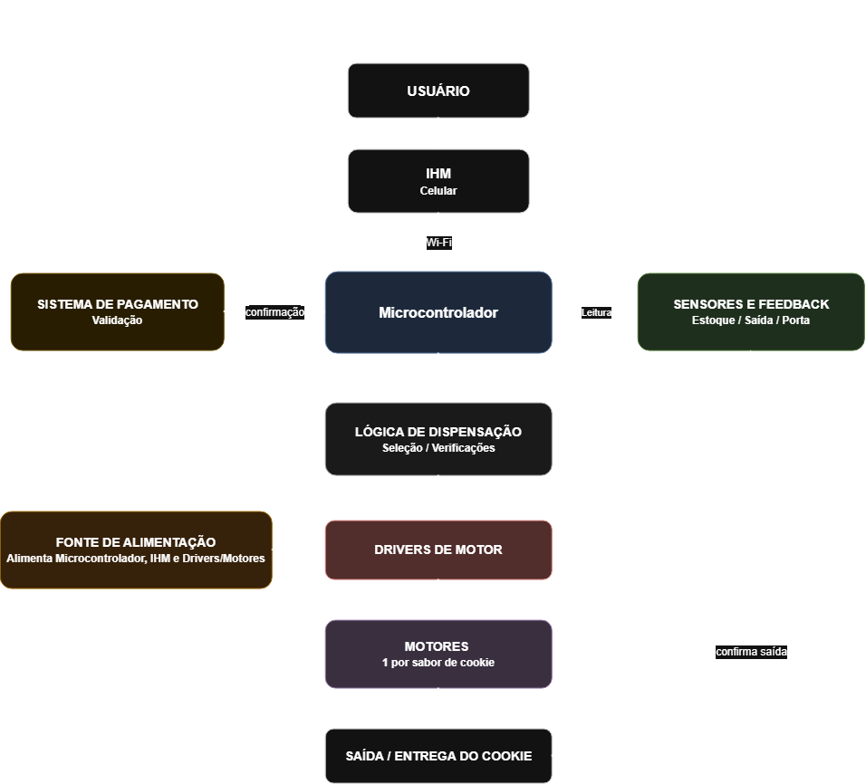

# Etapa 1

A etapa 1 foi dedicada à definição dos principais conceitos de hardware, software e mecânica da nossa cookie vending machine e de como essas três partes irão funcionar em conjunto. A proposta é desenvolver uma máquina automatizada que ofereça seis sabores de cookies, organizados em molas acopladas a motores de passo, com sensores para confirmar a entrega do produto e identificar a abertura da porta de manutenção. A interação com o usuário será feita por uma IHM, enquanto o microcontrolador será responsável por integrar esses elementos e controlar o funcionamento da máquina.

## Desenvolvimento

A ideia do projeto surgiu da proposta de desenvolver uma máquina de venda automática de pequeno porte, voltada a microempreendedores que produzem seus próprios alimentos e buscam uma alternativa para comercializá-los. Nesse contexto, escolhemos os cookies como produto para o desenvolvimento do protótipo.

### Conceito geral do funcionamento

A Figura 1 apresenta o diagrama de blocos do funcionamento geral da máquina. O usuário inicia a interação pela IHM, que se comunica por Wi-Fi com o microcontrolador. Este recebe o sabor selecionado, verifica as condições para a liberação e aciona o motor correspondente. A entrega do cookie é então verificada por meio do sensor ultrassônico.

  
   
  <em>Figura 1 — Diagrama de blocos da máquina.</em>

### Conceito geral do software 

A Figura 2 apresenta o fluxograma do software a ser implementado nas próximas etapas. Para realizar uma compra, o usuário deverá estar cadastrado e fazer login com sua senha. Após a seleção do sabor, o sistema verificará a disponibilidade em estoque e, caso haja produto disponível, acionará o motor correspondente. A entrega será confirmada pelo sensor. Caso o cookie não seja detectado, será necessário tratar a falha, definindo um limite de tentativas.

  
   
  <em>Figura 1 — Diagrama de blocos da máquina.</em>

### Definir como os cookies serão armazenados

Os cookies serão acondicionados individualmente em embalagens fechadas e posicionados entre as espiras, em canais separados por divisórias. O diâmetro da espiral, o passo entre voltas, a largura da guia e o espaço de saída serão definidos pelas dimensões máximas da embalagem. O produto deverá permanecer apoiado, sem compressão que favoreça quebra ou travamento.

O MDF será utilizado como estrutura do gabinete. As áreas de apoio, a calha e a bandeja terão superfícies lisas e removíveis para facilitar a limpeza; o alimento permanecerá protegido pela embalagem. O compartimento eletrônico será separado do espaço de produtos e da trajetória de queda.

### Interface com o usuário 

A interação com o usuário será realizada por meio de um celular utilizado como Interface Homem-Máquina (IHM), conectado ao microcontrolador por Wi-Fi. As telas foram organizadas para orientar cada etapa da compra: identificação por login e senha, seleção do sabor, conferência do pedido e acompanhamento da liberação do cookie. Ao final, a interface informará que o produto está disponível para retirada. 
As imagens abaixo apresentam exemplos das principais telas da interface. O fluxo completo pode ser consultado no [protótipo interativo no Figma](https://www.figma.com/proto/RLSzlbX6hY4JLrHZYsqM1v/Cookie-Vending-Machine---IHM-Mockup?node-id=2-19&viewport=-164%2C-284%2C0.24&t=vtPGIQQFpD4Fdbzo-1&scaling=scale-down&content-scaling=fixed&starting-point-node-id=2%3A19&page-id=0%3A1).

<table align="center">
  <tr>
    <td align="center">
      
       
      <em>Figura 3 — Tela de login.</em>
    </td>
    <td align="center">
      
       
      <em>Figura 4 — Escolha de sabor.</em>
    </td>
    <td align="center">
      
       
      <em>Figura 5 — Compra concluída.</em>
    </td>
  </tr>
</table>

### Armazenamento dos cookies

### Mecanismos de liberação

A alternativa escolhida para desenvolver o protótipo é a espiral acionada individualmente. A escolha aproveita as espirais de aço mola já produzidas e permite dividir os produtos em canais independentes. 

### Sensores 

Para o sensoriamento, utilizaremos um sensor ultrassônico para detectar a passagem do cookie e confirmar sua entrega, além de uma chave de fim de curso para identificar a abertura da porta de manutenção. Os modelos dos sensores serão definidos nas próximas etapas.

### Estrutura mecânica 

## Testes

Descrição dos testes/validações realizadas. Use fotos, diagramas, tabelas, etc.

## Referências (links/datasheets/livros)

- [nRF Connect SDK](https://developer.nordicsemi.com/nRF_Connect_SDK/doc/2.4.2/nrf/getting_started/modifying.html#configure-application>)

