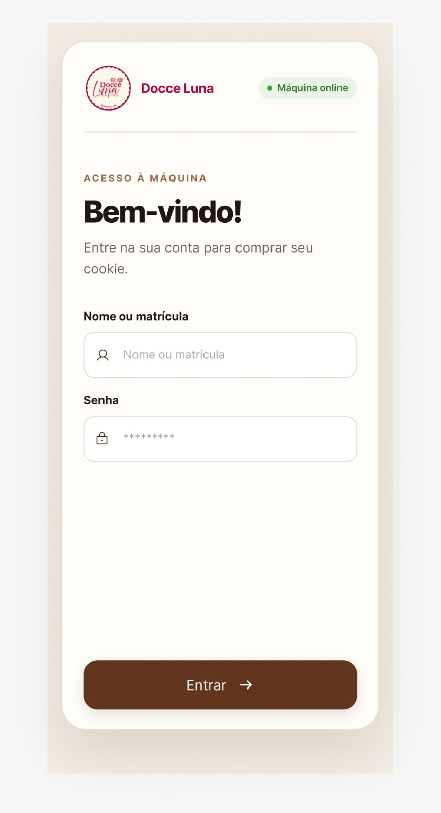
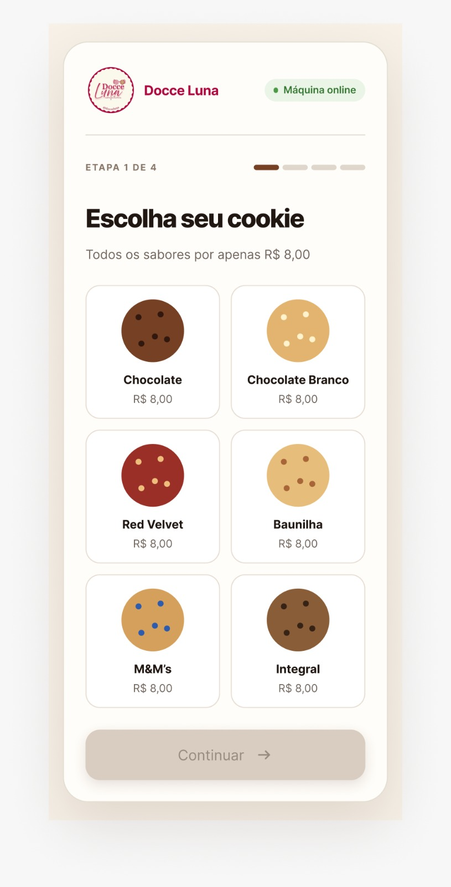
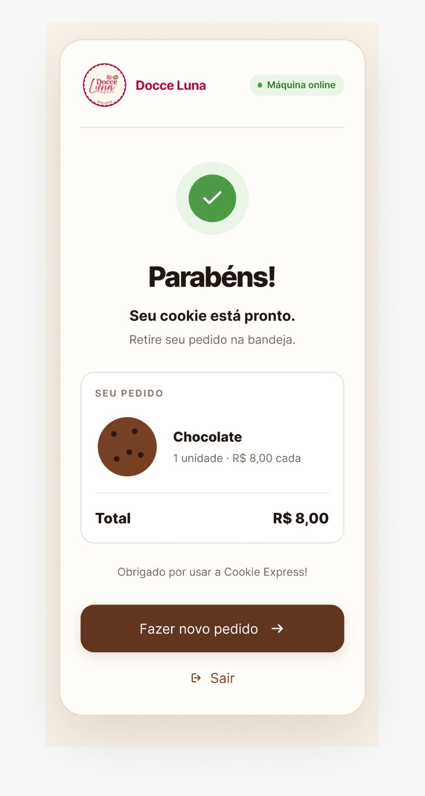

# Etapa 1

A etapa 1 foi dedicada à definição dos principais conceitos de hardware, software e mecânica da nossa cookie vending machine e de como essas três partes irão funcionar em conjunto. A proposta é desenvolver uma máquina automatizada que ofereça seis sabores de cookies, organizados em molas acopladas a motores de passo, com sensores para confirmar a entrega do produto e identificar a abertura da porta de manutenção. A interação com o usuário será feita por uma IHM, enquanto o microcontrolador será responsável por integrar esses elementos e controlar o funcionamento da máquina.

## Desenvolvimento

A ideia do projeto surgiu da proposta de desenvolver uma máquina de venda automática de pequeno porte, voltada a microempreendedores que produzem seus próprios alimentos e buscam uma alternativa para comercializá-los. Nesse contexto, escolhemos os cookies como produto para o desenvolvimento do protótipo.

### Conceito geral do funcionamento

A Figura 1 apresenta o diagrama de blocos do funcionamento geral da máquina. O usuário inicia a interação pela IHM, que se comunica por Wi-Fi com o microcontrolador. Este recebe o sabor selecionado, verifica as condições para a liberação e aciona o motor correspondente. A entrega do cookie é então verificada por meio do sensor ultrassônico.

 
  

   
  <em>Figura 1 — Diagrama de blocos da máquina.</em>

### Conceito geral do software 

A Figura 2 apresenta o fluxograma do software a ser implementado nas próximas etapas. Para realizar uma compra, o usuário deverá estar cadastrado e fazer login com sua senha. Após a seleção do sabor, o sistema verificará a disponibilidade em estoque e, caso haja produto disponível, acionará o motor correspondente. A entrega será confirmada pelo sensor. Caso o cookie não seja detectado, será necessário tratar a falha, definindo um limite de tentativas.

  
   
  <em>Figura 2 — Fluxograma de funcionamento.</em>

### Armazenamento e liberação dos cookies

A alternativa escolhida para o desenvolvimento do protótipo é o sistema de espirais acionadas individualmente, aproveitando as espirais de aço mola já produzidas e permitindo a divisão dos produtos em canais independentes. Os cookies serão armazenados em embalagens individuais fechadas, posicionadas entre as espiras, com os canais separados por divisórias. A reposição será realizada por uma tampa localizada na parte superior da caixa, facilitando o acesso ao compartimento de armazenamento.

A estrutura da caixa será fabricada em MDF, com superfícies de apoio e bandeja de retirada lisas e removíveis, facilitando a limpeza e a manutenção. O compartimento eletrônico ficará isolado da área de armazenamento e do caminho de queda dos cookies.

 
<em>Figura 3 — Molas fabricadas.</em>

 
<em>Figura 4 — Protótipo Inicial da Máquina.</em>

### Interface com o usuário 

A interação com o usuário será realizada por meio de um celular utilizado como Interface Homem-Máquina (IHM), conectado ao microcontrolador por Wi-Fi. As telas foram organizadas para orientar cada etapa da compra: identificação por login e senha, seleção do sabor, conferência do pedido e acompanhamento da liberação do cookie. Ao final, a interface informará que o produto está disponível para retirada. 
As imagens abaixo apresentam exemplos das principais telas da interface. O fluxo completo pode ser consultado no [protótipo interativo no Figma](https://www.figma.com/proto/RLSzlbX6hY4JLrHZYsqM1v/Cookie-Vending-Machine---IHM-Mockup?node-id=2-19&viewport=-164%2C-284%2C0.24&t=vtPGIQQFpD4Fdbzo-1&scaling=scale-down&content-scaling=fixed&starting-point-node-id=2%3A19&page-id=0%3A1).

<table align="center">
  <tr>
     <td align="center">
      
       
      <em>Figura 5 — Tela de login.</em>
    </td>
    <td align="center">
      
       
      <em>Figura 6 — Tela de login.</em>
    </td>
    <td align="center">
      
       
      <em>Figura 7 — Escolha de sabor.</em>
    </td>
    <td align="center">
      
       
      <em>Figura 8 — Compra concluída.</em>
    </td>
  </tr>
</table>

### Sensores 

Para garantir maior confiabilidade e segurança durante o funcionamento da máquina, serão utilizados sensores responsáveis pelo monitoramento das etapas de dispensação e reposição dos produtos. Na região de saída dos cookies será instalado um sensor fotoelétrico, utilizado para detectar a passagem do produto após o acionamento da espiral. Dessa forma, o sistema poderá confirmar se o cookie foi realmente liberado, permitindo identificar possíveis falhas no processo, como travamentos ou ausência de produto no canal.

Além disso, será instalado um sensor de fim de curso na tampa superior destinada à reposição dos cookies. Esse sensor permitirá identificar mecanicamente se a tampa está aberta ou fechada. Quando a tampa estiver fechada, o fim de curso permanecerá acionado, indicando ao sistema que a operação pode ocorrer normalmente. Caso a tampa seja aberta, o sensor mudará de estado e o sistema bloqueará automaticamente o acionamento dos motores, evitando a movimentação das espirais enquanto o operador estiver realizando a reposição dos produtos. Essa medida aumenta a segurança durante a utilização da máquina e reduz o risco de acionamentos acidentais enquanto houver acesso ao seu interior.

A utilização conjunta do sensor fotoelétrico e do sensor de fim de curso permitirá monitorar tanto a correta liberação dos cookies quanto as condições de segurança durante a reposição, contribuindo para um funcionamento mais confiável e controlado do protótipo.

