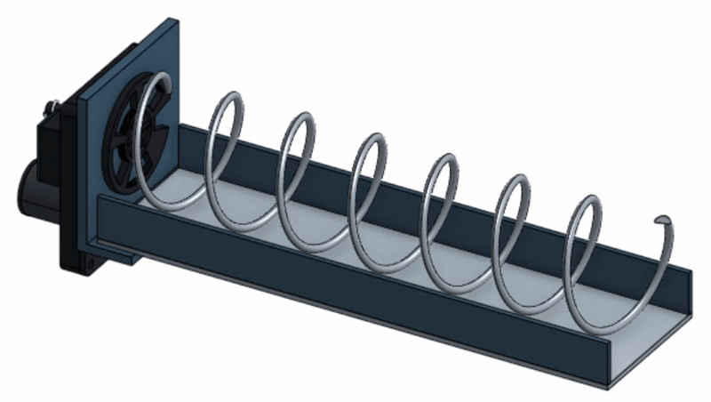
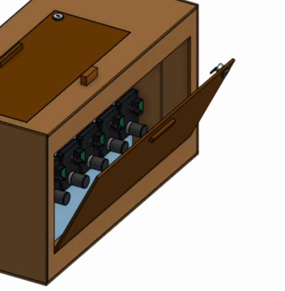
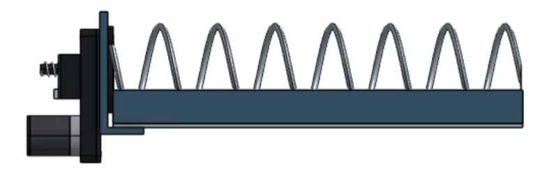
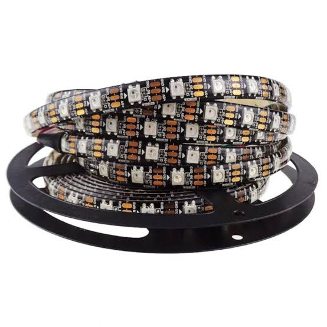
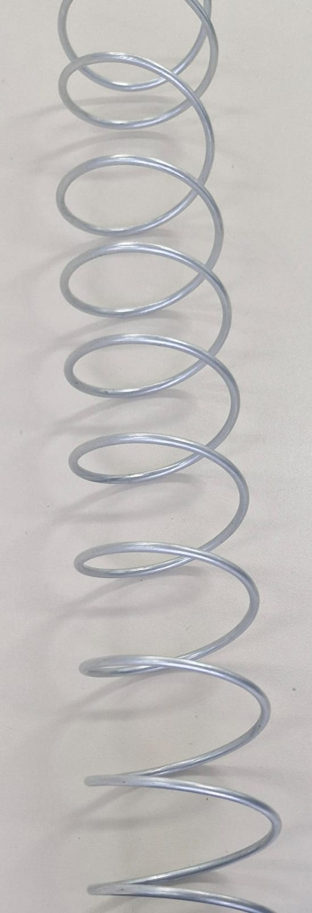
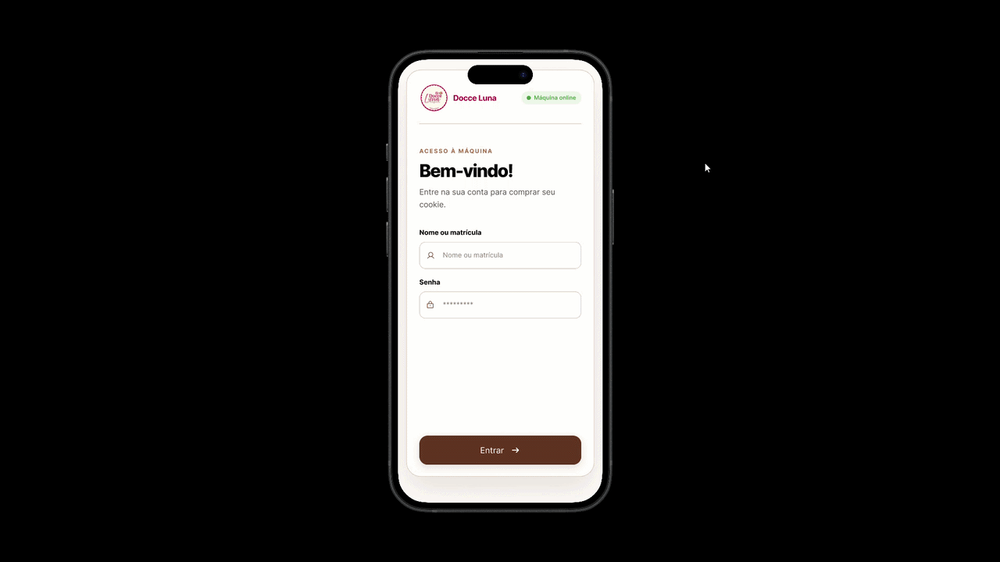
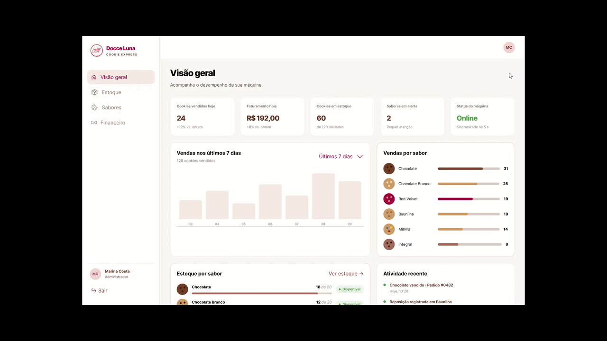

# Etapa 2

A etapa 2 tem como objetivo detalhar a construção da máquina de venda de cookies, considerando a estrutura, o armazenamento, a liberação dos produtos e os componentes eletrônicos. As atividades incluem verificar o acesso para manutenção e reposição, dimensionar a caixa, desenvolver os desenhos em CAD, projetar os mecanismos de armazenamento e dispensação, selecionar motores e sensores, definir o controlador e planejar o sistema de pagamento. Nesta etapa, as escolhas iniciais serão ajustadas conforme as dimensões dos cookies embalados e os resultados dos testes com o mecanismo.

## Desenvolvimento

### Estrutura, dimensionamento e manutenção

Conforme apresentado na **Figura 1**, a estrutura proposta utiliza MDF na base, nas laterais e na parte traseira, com um visor de acrílico na parte frontal, permitindo a visualização dos produtos. A reposição será realizada por meio de uma tampa superior, que dará acesso aos seis canais de armazenamento. Cada canal contará com uma espiral e um motor independente, responsáveis pela dispensação individual dos produtos.

  
   
  <em>Figura 1 — Estrutura completa.</em>

<table align="center">
  <tr>
    <td align="center">
      
    </td>
    <td align="center">
      
    </td>
    <td align="center">
      
    </td>
  </tr>
  <tr>
    <td align="center">
      <em>Figura 2 — Animação Mola</em>
    </td>
    <td align="center">
      <em>Figura 3 — Porta Manutenção.</em>
    </td>
    <td align="center">
      <em>Figura 4 — Animação Mola.</em>
    </td>
  </tr>
</table>

Conforme apresentado na **Figura 5**, o dimensionamento deverá considerar a largura e a altura das embalagens, o comprimento das espirais, a quantidade de cookies armazenada em cada canal e o espaço necessário para a instalação dos motores. Também será reservado espaço adequado para a passagem do produto até a bandeja de retirada, de modo a evitar pontos de interferência ou regiões onde a embalagem possa ficar presa durante a dispensação.

   
  <em>Figura 5 — Colocar uma imagem contendo todas as dimensoes.</em>

As superfícies de apoio e a bandeja de retirada serão lisas e removíveis para facilitar a limpeza. O compartimento eletrônico ficará separado da área dos produtos e terá acesso para manutenção. Os suportes dos motores e das espirais deverão permitir a desmontagem individual de cada conjunto.

Para iluminação será utilizado uma fita de led controlada pelo microcontrolador, conforme a figura 6.

  
   
  <em>Figura 6 — Fita led para iluminação.</em>

## Armazenamento e dispensação

Os cookies serão armazenados em embalagens individuais fechadas, posicionados entre as espiras das molas de aço mola. Divisórias separarão os canais e ajudarão a manter os produtos alinhados durante o avanço.

A liberação ocorrerá pela rotação da espiral correspondente ao produto selecionado. O movimento deslocará as embalagens em direção à saída, permitindo que o primeiro cookie caia na bandeja de retirada. O espaçamento das espiras e o avanço por venda deverão ser ajustados para liberar apenas uma unidade, sem comprimir os produtos.

Segue abaixo fotos da mola e cookie embalado respectivamente: 

<table align="center">
  <tr>
    <td align="center">
      
    </td>
    <td align="center">
      
    </td>
  </tr>
  <tr>
    <td align="center">
      <em>Figura 7 — Mola para armazenamento.</em>
    </td>
    <td align="center">
      <em>Figura 8 — Cookie embalado.</em>
    </td>
  </tr>
</table>

## Motores, Atuadores e Sensores

Para o sistema de entrega da máquina, foram realizados testes com diferentes tipos de motores, buscando uma solução que apresentasse torque suficiente para movimentar as molas responsáveis pelo armazenamento e liberação dos cookies, além de possuir baixo custo e simplicidade de acionamento.

Mais informações sobre motor, atuadores e sensores podem ser encontradas em [Hardware](./hardware/README.md)

## Escolha do microcontrolador 

O microcontrolador escolhido para o projeto foi o ESP32, principalmente por possuir Wi-Fi integrado, boa quantidade de GPIOs e baixo custo.
Além disso, ele oferece desempenho suficiente para controlar os motores, sensores e a comunicação com a IHM.
Sua ampla documentação e disponibilidade também facilitam o desenvolvimento e a implementação do sistema.

Mais informações sobre a escolha do microcontrolador podem ser encontradas em [Hardware](./hardware/README.md)

## Cadastro do usuário

Antes de realizar uma compra, o usuário deverá se identificar pela IHM da máquina. Caso ainda não possua cadastro, poderá realizar um cadastro simples utilizando a própria interface.

Após a identificação, o usuário poderá visualizar os sabores disponíveis e selecionar o cookie desejado.

Abaixo GIF do funcionamento básico do APP da IHM

  
   
  <em>Figura 9 — Funcionamento Aplicativo IHM.</em>

### Funcionamento do sistema

Após a seleção do produto, a IHM registrará a solicitação e enviará o comando ao microcontrolador. O microcontrolador será responsável por acionar o motor correspondente ao sabor escolhido.

Depois da liberação do produto, o sensor de barreira verificará a passagem do cookie. Caso a entrega seja confirmada, a compra será registrada no histórico do usuário juntamente com informações como produto selecionado, data e horário.

Caso o sensor não identifique a passagem do produto após o acionamento do motor, a operação poderá ser registrada como uma falha de entrega, evitando que uma compra seja contabilizada sem que o usuário tenha recebido o produto.

### Cobrança e histórico

Como o pagamento não será realizado diretamente na máquina, as compras registradas poderão ser utilizadas posteriormente para realizar a cobrança de cada usuário.

O sistema permitirá consultar o histórico de consumo e o valor acumulado das compras realizadas em uma área administrativa.

Abaixo GIF do funcionamento básico da página web do backoffice:

  
   
  <em>Figura 10 — Funcionamento Página WEB Backoffice.</em>

## Referências

* [1] [Pololu — Motor de passo bipolar NEMA 17, modelo 2267](https://www.pololu.com/product/2267).
* [2] [Pololu — Driver de motor de passo DRV8825](https://www.pololu.com/product/2133).
* [3] [Espressif — Datasheet da série ESP32](https://www.espressif.com/sites/default/files/documentation/esp32_datasheet_en.pdf).
* [4] [Adafruit — Sensor infravermelho de barreira 2168](https://www.adafruit.com/product/2168).

