# Hardware

## Motores, atuadores e sensores 

Inicialmente, foi testado um motor DC genérico com redução. Durante os testes, o motor não apresentou funcionamento adequado quando havia apenas um cookie no mecanismo. o torque fornecido pelo motor não foi suficiente para realizar o movimento completo da mola, inviabilizando sua utilização no projeto.

Em seguida, foi testado um motor de passo NEMA 17, acionado por meio de um driver conectado a um shield para Arduino. Esse motor apresentou torque suficiente para movimentar a mola mesmo quando havia mais de um cookie armazenado, atendendo aos requisitos mecânicos do sistema. Apesar do bom desempenho, seu custo mais elevado e a necessidade de utilização de um driver específico motivaram a busca por uma alternativa mais simples e econômica.

No terceiro teste, foi utilizado um motor DC com redução desenvolvido para aplicações em máquinas de venda automática. Esse motor apresentou torque suficiente para movimentar o mecanismo mesmo com vários produtos armazenados e demonstrou funcionamento satisfatório durante os testes. Além disso, possui menor custo e um sistema de acionamento mais simples quando comparado ao motor de passo.

Dessa forma, o motor DC com redução para máquinas de venda automática foi escolhido para a versão final do projeto.

Abaixo foto dos motores testados: 

<table align="center">
  <tr>
    <td align="center">
      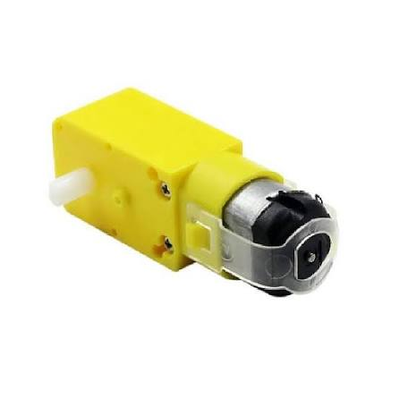
    </td>
    <td align="center">
      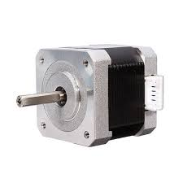
    </td>
    <td align="center">
      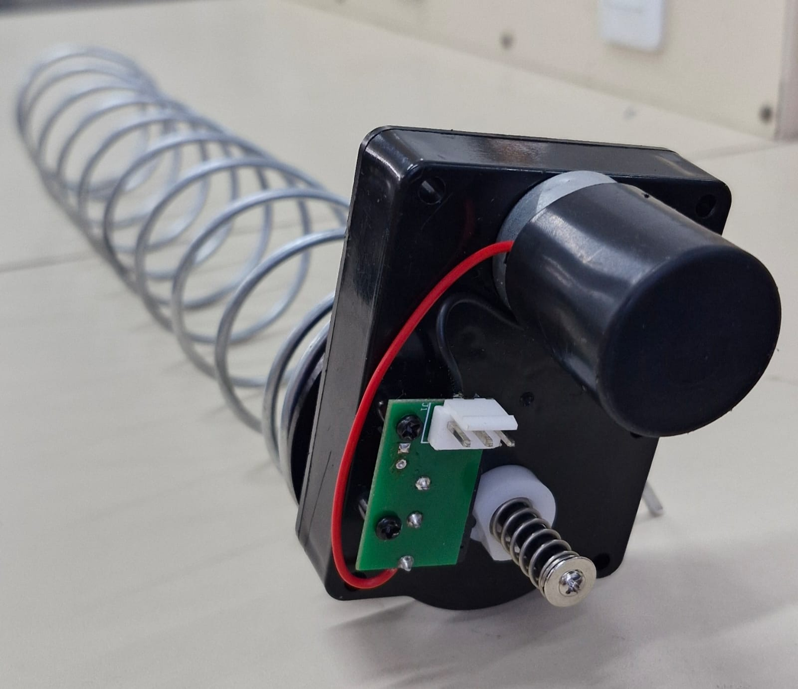
    </td>
  </tr>
  <tr>
    <td align="center">
      <em>Figura 1 — Motor DC.</em>
    </td>
    <td align="center">
      <em>Figura 2 — Motor de Passo.</em>
    </td>
        <td align="center">
      <em>Figura 3 — Motor de Máquina de Venda.</em>
    </td>
  </tr>
</table>

### Acionamento dos motores

Como os motores selecionados são motores DC, não será necessária a utilização de drivers específicos para motores de passo. O acionamento será realizado por meio de um circuito de potência simples utilizando um MOSFET e resistores, conforme apresentado na Figura X.

A máquina possui seis mecanismos independentes de entrega, cada um responsável por um sabor diferente de cookie. A forma de acionamento individual dos seis motores ainda está em estudo. O circuito apresentado representa uma configuração de teste, e a solução final será definida após a avaliação dos componentes e dos resultados dos testes.

Abaixo circuito do acionamento utilizado: 

<table align="center">
  <tr>
    <td align="center">
      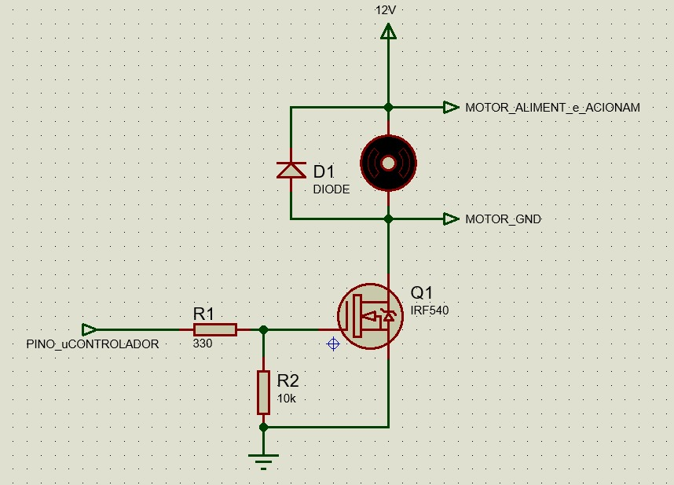
    </td>
    <td align="center">
      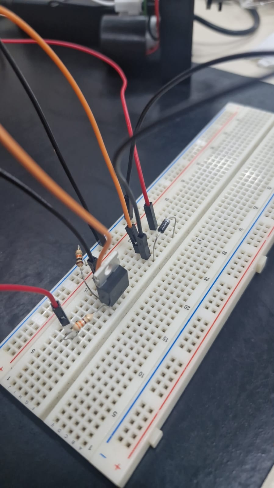
    </td>
  </tr>
  <tr>
    <td align="center">
      <em>Figura 4 — Circuito do Acionamento.</em>
    </td>
    <td align="center">
      <em>Figura 5 — Circuito Montado em Bancada.</em>
    </td>
  </tr>
</table>

### Sensores de detecção de produto

Para confirmar que o cookie foi efetivamente liberado após o acionamento do motor, será utilizado um sistema de barreira infravermelha.

O conjunto selecionado é formado pelo receptor infravermelho **TSSP58038**, apresentado na **Figura 6**, e pelo emissor infravermelho **TSAL6200**, apresentado na **Figura 7**, respectivamente.

O TSAL6200 é responsável pela emissão da luz infravermelha, enquanto o TSSP58038 realiza a detecção desse sinal. Os dois componentes serão posicionados em lados opostos do caminho de queda do produto, formando uma barreira óptica.

Quando não houver nenhum objeto entre os componentes, o receptor detectará normalmente o sinal infravermelho emitido. Durante a queda de um cookie, essa comunicação será momentaneamente interrompida, permitindo que o microcontrolador identifique a passagem do produto.

No projeto, serão utilizados **três emissores TSAL6200 e dois receptores TSSP58038**. Esses componentes serão distribuídos de forma a monitorar a passagem dos produtos e confirmar que a entrega ocorreu corretamente.

Os sensores não serão responsáveis pelo controle direto dos motores. Sua função será atuar como um sistema independente de confirmação da liberação do produto após o acionamento do mecanismo de entrega.

<table align="center">
  <tr>
    <td align="center">
      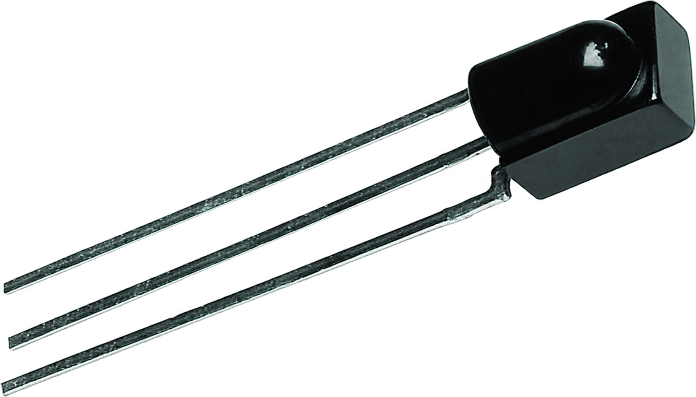
    </td>
    <td align="center">
      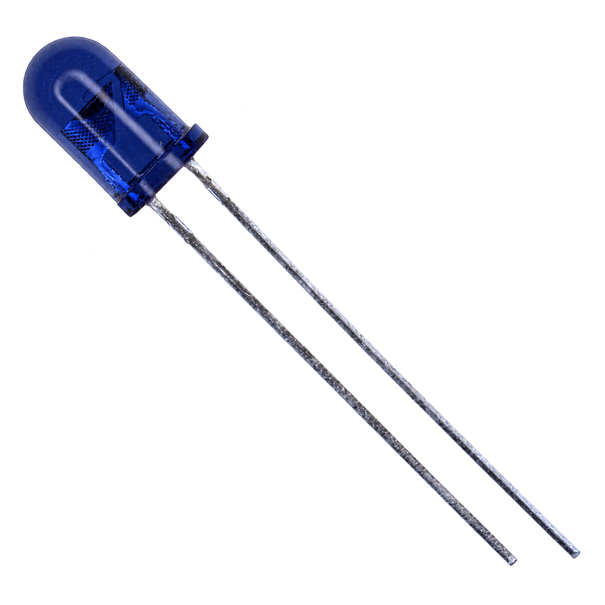
    </td>
  </tr>
  <tr>
    <td align="center">
      <em>Figura 6 — Receptor TSSP58038.</em>
    </td>
    <td align="center">
      <em>Figura 7 — Emissor TSAL6200.</em>
    </td>
  </tr>
</table>

## Microcontrolador 

Para a escolha do microcontrolador, foram comparadas três opções principais:

- **ESP32**
  - Wi-Fi integrado;
  - Quantidade suficiente de GPIOs para o projeto;
  - Baixo custo;
  - Boa disponibilidade no mercado;
  - Implementação mais simples para comunicação com a IHM.

- **NXP RW610**
  - Possui conectividade sem fio;
  - Apresenta bom desempenho;
  - Custo mais elevado em comparação ao ESP32;
  - Menor disponibilidade no mercado.

- **STM32F411 Black Pill**
  - Baixo consumo de energia;
  - Boa quantidade de GPIOs;
  - Não possui Wi-Fi integrado;
  - Necessita de um módulo adicional para comunicação sem fio com a IHM.

Como a vending machine será alimentada continuamente pela rede elétrica, o baixo consumo de energia não representa um requisito crítico para o projeto. Dessa forma, essa vantagem da STM32F411 Black Pill e de outras soluções de baixo consumo possui menor peso na decisão.

Considerando conectividade, número de GPIOs, custo, disponibilidade e simplicidade de implementação, o **ESP32 foi selecionado para o projeto**. A **Figura 8** apresenta o modelo de ESP32  ser utilizado.

  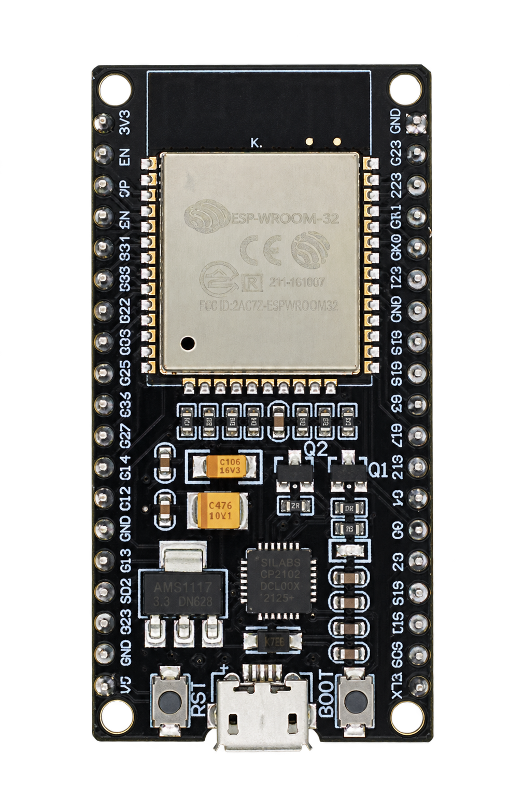
   
  <em>Figura 8 — ESP32.</em>

## Testes

Os testes realizados tiveram como objetivo validar o funcionamento dos principais componentes do sistema, especialmente os motores, drivers e sensores. Durante essa etapa, foram avaliados o acionamento dos motores, o comportamento das molas e a detecção da passagem dos cookies. Esses testes permitiram identificar ajustes necessários antes da integração definitiva dos componentes na vending machine.

Abaixo, podem ser visualizados os vídeos dos testes realizados, demonstrando o funcionamento dos componentes e dos mecanismos avaliados durante esta etapa do desenvolvimento.

### Teste Motor DC 

  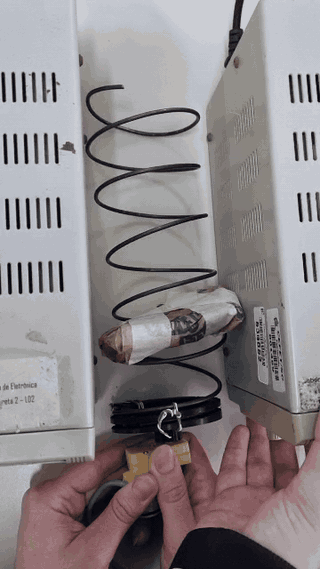
   
  <em>Video 01 — Teste Motor DC.</em>

### Teste Motor de passo 

  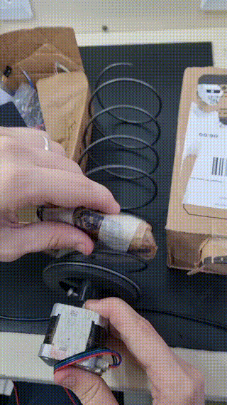
   
  <em>Video 02 — Teste Motor de Passo.</em>

### Teste Motor para máquina de vendas

  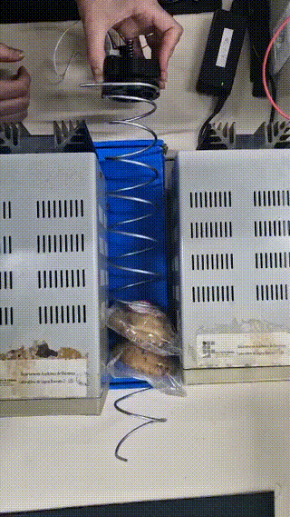
   
  <em>Video 03 — Teste Motor para Máquina de Vendas.</em>

